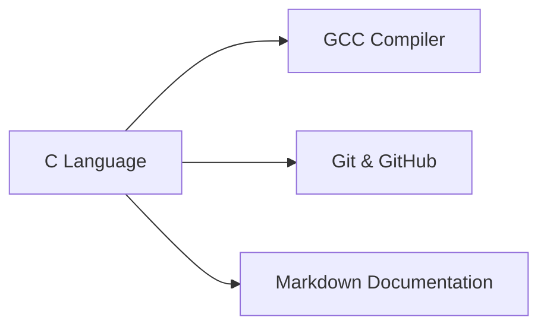

<!-- TITLE -->
# 🔢 Numerical Methods in Programming (NMP)

> 💡 A comprehensive collection of C programs implementing **numerical methods** — categorized into beginner, intermediate, and advanced levels for quick reference and academic use.

<!-- BADGES -->
<div align="center">
  
  
  
  
</div>

<br>

<!-- ANIMATED HEADING -->
<div align="center">
  
</div>

---

## 📂 Project Structure

```bash
NMP/
├── BISECTION/
│   ├── BISECTION_BEGINNER.C
│   └── BISECTION_INTERMEDIATE.C
├── LAGRANGES/
│   ├── LAGRANGES_BEG.C
│   └── LAGRANGES_BEG.exe
├── NEWTON BACKWARD INTERPOLATION/
│   ├── NB_BEGINNER.C
│   ├── NB_BEGINNER.exe
│   └── NB_INTERMEDIATE.C
└── ... (other directories)
```

---

## 🌈 Features

<div align="center">

| Category        | Benefits                                                                 |
|-----------------|--------------------------------------------------------------------------|
| **Structured**  | Organized into modules and difficulty levels                             |
| **Ready-to-Use**| Includes both source code and compiled binaries                          |
| **Educational** | Perfect for academic learning and practical labs                         |
| **Extensible**  | Easy to adapt and build upon for projects                               |

</div>

---

## 🛠 Tech Stack

<div align="center">



</div>

---

## 📜 License

This project is licensed under the **MIT License** - see the [LICENSE](LICENSE) file for details.

---

## 🤝 How to Contribute

1. 🍴 Fork the repository
2. 📥 Clone locally: `git clone https://github.com/your-username/Numerical-Methods.git`
3. 🌿 Create your feature branch: `git checkout -b feature/amazing-feature`
4. 💾 Commit your changes: `git commit -m 'Add some amazing feature'`
5. 🚀 Push to the branch: `git push origin feature/amazing-feature`
6. 🔄 Open a Pull Request

---

## 📬 Connect With Me

<div align="center">

[](https://github.com/TheLearnerAllTime002)
[](https://www.linkedin.com/in/arjun-mitra-2761a9260)

</div>

---

## ✨ Final Quote

<div align="center">
  
</div>

<div align="center">
  <br>
  
  <br>
  <p>⭐️ Star this repo if you find it useful!</p>
</div>
```

