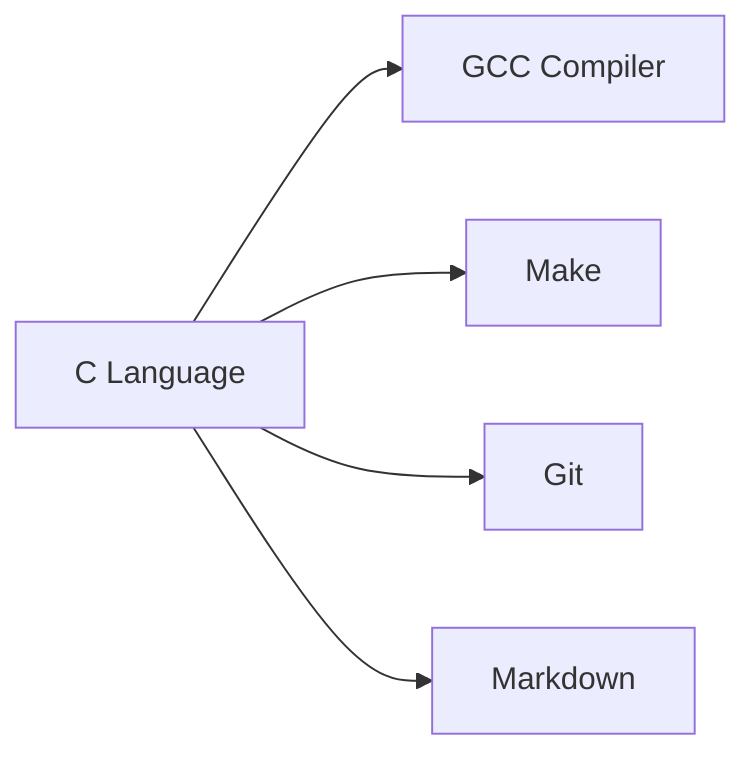


# 🔢 Numerical Methods in Programming (NMP)

> 💡 A comprehensive collection of C programs implementing **numerical methods** — categorized into beginner, intermediate, and advanced levels for quick reference and academic use.

<div align="center">
  
  
  
  
</div>

<br>

<div align="center">
  
</div>

---

## 📂 Project Structure

```bash
Numerical-Methods/
├── 📊 Interpolation/
│   ├── Lagrange's Method/
│   │   └── LAGRANGES_BEG.C
│   ├── Newton Backward/
│   │   ├── NB_BEGINNER.C
│   │   └── NB_INTERMEDIATE.C
│   └── Newton Forward/
│       └── NF_BEGINNER.C
│
├── ∫ Numerical Integration/
│   ├── Simpson's 1/3 Rule/
│   │   ├── SIMP_1_3_BEGINNER.C
│   │   └── SIMP_1_3_INTERMEDIATE.C
│   ├── Trapezoidal Method/
│   │   ├── TRAPEZOIDAL_BEGINNER.C
│   │   └── TRAPEZOIDAL_INTERMEDIATE.C
│   └── Weddle's Rule/
│       ├── WEEDLE_BEGINNER.C
│       └── WEEDLE_INTERMEDIATE.C
│
├── 🔍 Root Finding/
│   ├── Bisection/
│   │   ├── BISECTION_BEGINNER.C
│   │   └── BISECTION_INTERMEDIATE.C
│   ├── Newton-Raphson/
│   │   ├── NR_IG_BEG.C
│   │   ├── NR_INTERMEDIATE.C
│   │   ├── NR_INTERVAL_BEG.C
│   │   └── NR_INTERVAL_INTERMEDIATE.C
│   └── Regula Falsi/
│       ├── REGULA_FALSI_BEGINNER.C
│       └── REGULA_FALSI_INTERMEDIATE.C
│
├── ➗ Linear Algebra/
│   ├── Gauss Elimination/
│   │   ├── GAUSS_ELIMINATION_BEG.C
│   │   └── GAUSS_ELIMINATION_ADV.C
│   └── Gauss-Seidel/
│       ├── GAUSS_SEIDAL.C
│       ├── GAUSS_SEIDAL_INTERMEDIATE.C
│       └── GAUSS_SEIDAL_ADVANCED.C
│
├── 📈 Differential Equations/
│   ├── Euler's Method/
│   │   ├── EULER_SIMPLIFIED.C
│   │   └── EULER_ADV.C
│   └── Runge-Kutta/
│       └── RK_4TH.C
│
└── 📜 Project Files/
    ├── LICENSE
    ├── README.md
    └── .gitignore
```

---

## 🌟 Key Features

<div align="center">

| Category        | Implementation Details                  | Benefits                          |
|-----------------|----------------------------------------|-----------------------------------|
| Multi-Level     | Beginner → Intermediate versions       | Progressive learning              |
| Robust          | Input validation & error handling      | Production-ready code             |
| Organized       | Logical method categorization          | Easy navigation                   |
| Portable        | Standard C with GCC compatibility      | Cross-platform support            |
| Documented      | Clean code with comments               | Easy to understand                |

</div>

---

## 🛠 Tech Stack



---

## 📊 Method Distribution

```mermaid
pie showData
    title Numerical Methods Coverage
    "Root Finding" : 8
    "Interpolation" : 6
    "Numerical Integration" : 7
    "Linear Equations" : 5
    "Differential Equations" : 3

---

## 📜 License

MIT Licensed - See [LICENSE](LICENSE) for details.

---

## 🤝 How to Contribute

1. Fork the repository
2. Create your feature branch (`git checkout -b feature/fooBar`)
3. Commit your changes (`git commit -am 'Add some fooBar'`)
4. Push to the branch (`git push origin feature/fooBar`)
5. Create a new Pull Request

---

## 📬 Connect

<div align="center">
  <a href="https://github.com/TheLearnerAllTime002">
    
  </a>
  <a href="https://www.linkedin.com/in/arjun-mitra-2761a9260">
    
  </a>
</div>

---

<div align="center">
  
  <br>
  
  <p>⭐ Star this repository if you find it useful!</p>
</div>
